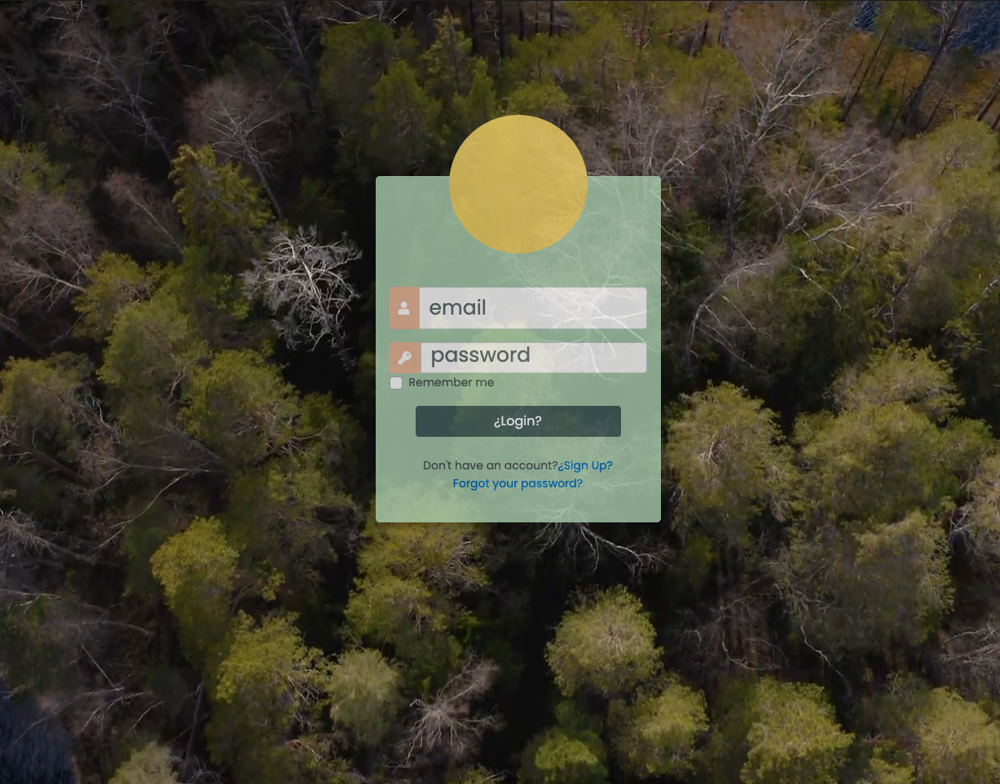
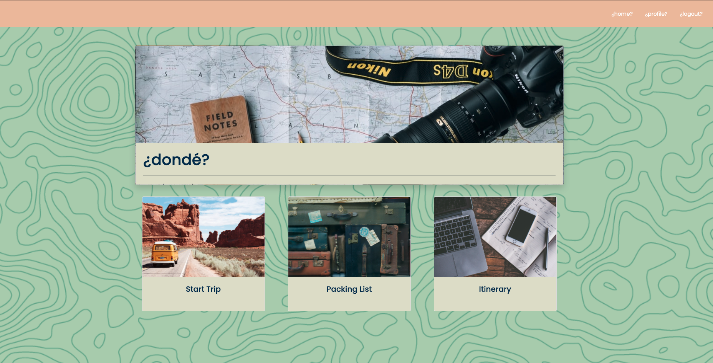
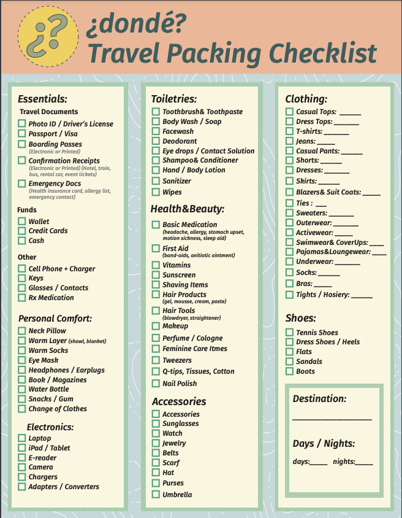

The application can be viewed from here:
> https://shielded-woodland-30004.herokuapp.com/

## dondé (dohn-deh)
 

## _Description_

This application was designed for the everyday person. Ask yourself this question; Have I ever needed a vacation so badly, but did not know where to start...yeah of course you have, we ALL have. Welcome to Dondé, (where) we take the hard work of planning Trips out of your hands! Our site helps optimize your travel itinerary to let you make the most out of your trip!

## _Technologies_

## _Usage_

You can find the application Repository here:
> https://github.com/jmasone15/travel-planner-project

